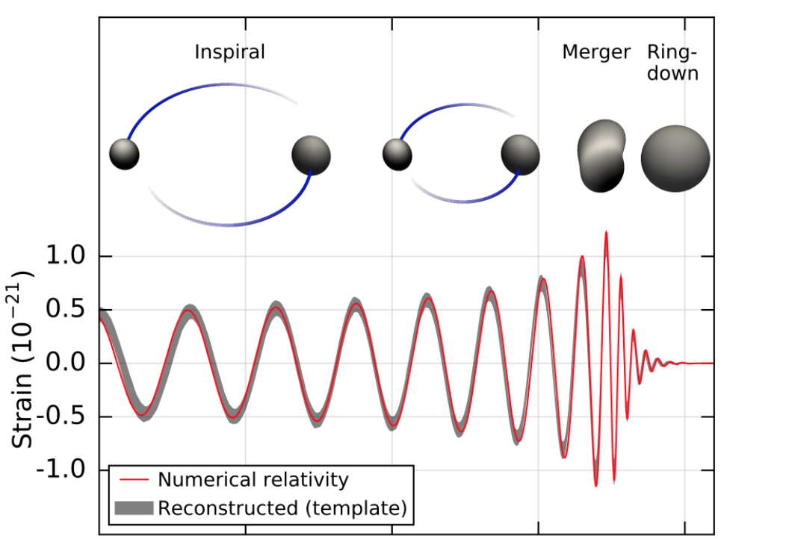

# Detecting LIGO Gravitational Waves

## Overview

This directory contains an analysis of gravitational wave data from the LIGO (Laser Interferometer Gravitational-wave Observatory) detectors. The `Gravitational_Strain_Analysis.ipynb` notebook demonstrates the detection and characterization of the GW150914 event—the first confirmed observation of gravitational waves from a binary black hole merger on September 14, 2015.

## Project Goals

The notebook accomplishes the following key objectives:

1. **Load and visualize LIGO detector data** from the H1 (Hanford) and L1 (Livingston) detectors
2. **Analyze noise characteristics** through power spectral density (PSD) and amplitude spectral density (ASD) calculations
3. **Model gravitational waveforms** using differential equations based on general relativity
4. **Apply signal processing techniques** including whitening and bandpass filtering to suppress noise
5. **Implement matched filtering** to detect weak signals buried in detector noise
6. **Quantify signal detection** using signal-to-noise ratio (SNR) analysis
7. **Verify theoretical predictions** by comparing observed waveforms with general relativity models

## Analysis Steps

### 1. Data Loading and Visualization
- Load strain data from LIGO H1 and L1 detectors (32-second recordings at 4096 Hz sampling rate)
- Plot raw strain data in the time domain with event markers
- Analyze frequency content using Fast Fourier Transforms (FFTs)

### 2. Noise Characterization
- Compute Power Spectral Density (PSD) using Welch's method
- Calculate Amplitude Spectral Density (ASD) by taking square roots of PSD values
- Visualize noise characteristics across frequency bands (20-2000 Hz)
- Identify the most sensitive frequency range where GW150914 signal is detectable

### 3. Gravitational Waveform Modeling
The notebook models the inspiral phase of a binary black hole system by solving the differential equation describing how the orbital separation decreases as energy is radiated:

$$\frac{dr}{dt} = -\frac{\eta N c}{4}\left(\frac{r_s}{r}\right)^3$$

Three numerical/analytical methods are compared:
- **Analytical Solution:** Exact closed-form solution to the differential equation
- **Euler's Method:** Simple numerical integration approach
- **Runge-Kutta Method:** Higher-order numerical integration for improved accuracy

These methods generate predicted waveforms at different binary masses ($M = 55, 60.5, 65 M_{\odot}$) and are compared with actual template waveforms from the detector data.

### 4. Data Preprocessing
- **Whitening:** Divide detector data by noise ASD in the Fourier domain to suppress low-frequency noise and spectral lines
- **Bandpass Filtering:** Apply Butterworth filter (43-360 Hz) to isolate the frequency band containing the GW signal
- These techniques reduce noise by $\sim 10^5$ at low frequencies, enhancing signal visibility

### 5. Matched Filtering
The core detection technique uses optimal matched filtering in the frequency domain:

1. Compute FFTs of the template waveform and detector data
2. Multiply in frequency space: multiply data FFT by conjugate of template FFT
3. Divide by noise power spectral density to weight by signal-to-noise ratio
4. Transform back to time domain using inverse FFT
5. This produces a time series showing correlation at each possible time lag

### 6. Signal Detection and Characterization
- Normalize matched filter output to compute Signal-to-Noise Ratio (SNR)
- Identify peak SNR value and corresponding detection time
- Extract phase and time offset of detected signal
- Apply corrections to visualize matched waveform overlaid with detector data
- Calculate effective distance ($d_{\text{eff}}$) and horizon distance to characterize detector sensitivity

### 7. Results Visualization
- Plot SNR as a function of time showing clear peak at event time
- Display whitened strain data alongside the matched template waveform
- Demonstrate excellent agreement between theoretical predictions and observed data
- Confirm signal characteristics (frequency evolution, amplitude growth) match general relativity predictions

## Key Findings

The analysis demonstrates that:
- The GW150914 signal shows clear frequency evolution from ~35 Hz to ~250 Hz (characteristic of inspiraling black holes)
- Matched filtering successfully extracts a signal with SNR > 8 in single-detector data
- The observed waveform matches predictions from general relativity with high fidelity
- Both H1 and L1 detectors registered nearly simultaneous, consistent signals
- Advanced signal processing (whitening, filtering, matched filtering) is essential for detecting gravitational waves buried in instrumental noise

## Files in This Directory

- `Gravitational_Strain_Analysis.ipynb` - Complete analysis notebook with code and visualizations
- `H-H1_LOSC_4_V2-1126259446-32.hdf5` - Raw strain data from LIGO Hanford (H1) detector
- `L-L1_LOSC_4_V2-1126259446-32.hdf5` - Raw strain data from LIGO Livingston (L1) detector
- `GW150914_4_template.hdf5` - Template waveform for matched filtering
- `BBH_events_v3.json` - Event metadata and parameters
- `imgs/` - Directory containing visualization images

## References

- LIGO Scientific Collaboration & Virgo Collaboration. "Observation of Gravitational Waves from a Binary Black Hole Merger." Physical Review Letters, 2016. https://arxiv.org/abs/1602.03837
- LIGO Open Science Center: http://www.ligo.org/science/Publication-GW150914/
- Inspiral simulation: http://www.glowscript.org/#/user/rhilborn/folder/Public/program/BinaryInSpiral
